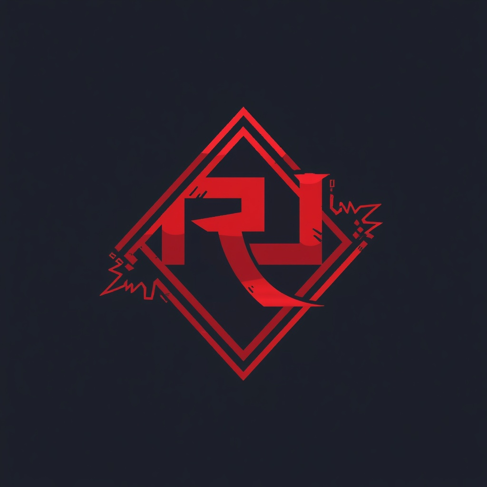

<!-- ═══════════════════════════════════════════════════════════ -->
<!--  RIFT DECK OS — README                                       -->
<!--  Colors: Navy #060A1A · Pink #FF3CAC · Orange #FF8C42        -->
<!-- ═══════════════════════════════════════════════════════════ -->

<!-- ANIMATED WAVY BANNER 1 -->

<!-- LOGO -->

  

<!-- STATUS BADGES -->

<!-- ANIMATED WAVY DIVIDER -->

## 🎮 What Is Rift Deck OS?

**Rift Deck OS** is a console-style Linux gaming operating system built on **Alpine Linux**.

It turns your laptop or PC into a **console** — no desktop, no clutter, no distraction.
Just boot up, log in, and play.

---

## 🏆 What Makes It Better

> **Rift Deck OS is free.** But it behaves like a console.
> Same experience. No price tag. No locked ecosystem.

| Feature | Why It Matters |
|---------|----------------|
| 🎮 **Console-first UI** | Boots directly into Steam Big Picture. Feels like a PS5 or Xbox, not a PC. |
| 🪶 **Lightweight** | Built on Alpine. Fast boot, tiny footprint, runs on modest hardware. |
| 💸 **Free Core** | The OS itself costs nothing. Ever. Paid tiers only add extras. |
| 🔒 **Locked-down experience** | System files are not editable. No accidental breakage. It just works. |
| 🕹️ **Controller-first** | Xbox, PlayStation, and generic gamepads work out of the box. |
| 🔄 **Auto-updates** | Get notified when updates are available. One tap and you're done. |

---

## 🎯 What Users Can Do

### 🎮 Play Steam Games
Log into your **Steam account** and play your full library —
including Windows games via **Proton**.

### ☁️ Play Xbox Cloud Games
Log into your **Microsoft account** and stream Xbox titles
directly from the cloud through the built-in browser.

### 🛒 Install From the Rift Store
A curated store with only approved apps.

### 💾 Add External Storage
Plug in a USB drive or external SSD and install games to it.
Your library, your space, your rules.

---

## 🚧 Coming Soon

| Feature | Status |
|---------|--------|
| 🕹️ Emulator support | 🔜 In development |
| 🛒 Rift Store full launch | 🔜 In development |
| 🎬 Animated boot screen | 🔜 Planned |
| 🎨 Custom themes | 🔜 Planned |

---

## ⚠️ Important Notes

> **Rift Deck OS is NOT released yet.**
> This repository is under active development.

> **Editing system files is not allowed.**
> Rift Deck OS is a locked console experience.
> You play games — you don't fight the OS.

> **The core OS is free.**
> Some premium features may be paid. Playing your own games never will be.

---

## 💻 Supported Hardware

**Minimum:**
x86_64 dual-core · 4GB RAM · 32GB storage · Vulkan-capable GPU

**Recommended:**
Quad-core 3GHz+ · 8GB RAM · 128GB SSD · GTX 1050 / RX 560 / Iris Xe

**Tested on:**
ThinkPad · Dell XPS · Framework · HP EliteBook · Custom PCs

**Not supported:**
ARM devices · Macs · 32-bit systems

---

---

## 📜 License

**GPL-3.0** — see [LICENSE](LICENSE)

Built on [Alpine Linux](https://alpinelinux.org).

*Steam is a trademark of Valve Corporation.*
*Xbox is a trademark of Microsoft Corporation.*
*Rift Deck OS is not affiliated with Valve or Microsoft.*

<!-- ANIMATED WAVY FOOTER -->

### Boot. Login. Play.

